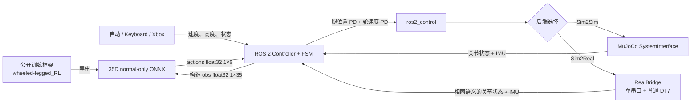

# WheelBipe ROS 2 Sim2Sim / Sim2Real

26 赛季轮腿步兵强化学习的 ROS 2 / `ros2_control` 策略部署框架。仓库提供一条可直接运行的 normal-only 链路：读取机器人状态，构造 35 维观测，通过 ONNX Runtime 在 CPU 上推理 6 维动作，并通过统一的 `ros2_control` 接口驱动 MuJoCo 或真机硬件。

## Sim2Sim / Sim2Real 一键切换架构

策略、35D 观测、6D 动作、FSM、ROS topic、Keyboard 和 Xbox 都与执行后端解耦。Sim2Sim 与 Sim2Real 只在 `ros2_control` hardware plugin 层切换：默认命令运行 MuJoCo，增加 `--real` 即切到单串口真机驱动，无需修改控制器、重新导出 ONNX 或维护两套上层控制代码。

## 支持范围

| 项目 | 当前支持 |
| --- | --- |
| 系统 | Ubuntu 22.04 x86_64 |
| ROS | ROS 2 Humble |
| 仿真 | MuJoCo 3.5.0，GUI / Headless |
| 推理 | ONNX Runtime 1.20.0 CPU |
| 策略合同 | 单输入 `obs`：`float32[1,35]`；单输出 `actions`：`float32[1,6]` |
| 控制输入 | 仿真自动进入 RL、Keyboard、Xbox evdev、真机普通 DT7 |
| 策略模式 | normal-only；索引 28–34 恒为 `[1,0,0,0,0,0,0]` |
| 后端切换 | `./scripts/demo.sh` 为 MuJoCo；`./scripts/demo.sh --real` 为单串口真机 |

## 快速开始

安装 ROS 2 Humble 后，在仓库根目录执行：

```bash
./scripts/bootstrap.sh
./scripts/build.sh
./scripts/demo.sh
```

无界面运行 10 秒：

```bash
./scripts/demo.sh --headless --duration 10
```

真机一键启动（默认 `/dev/wheelbipe_h7`，普通 DT7 输入，且不会自动进入 RL）：

```bash
./scripts/check_real.sh
./scripts/demo.sh --real
```

临时串口路径可用 `--serial-port /dev/ttyUSB0` 覆盖。真机使用 Keyboard 时执行 `./scripts/demo.sh --real --no-dt7`；使用 Xbox 时执行 `./scripts/demo.sh --real --xbox`。首次运行前必须完成 udev/权限配置并阅读 [DEPLOY.md](DEPLOY.md) 的真机安全边界。

Xbox 控制：

```bash
./scripts/check_xbox.sh
./scripts/demo.sh --xbox
```

键盘控制需要两个终端。第一个终端保持仿真运行：

```bash
./scripts/demo.sh
```

第二个终端执行：

```bash
source setup_ros_domain.bash
ros2 run keyboard_teleop keyboard_teleop_node --ros-args \
  --params-file src/tools/keyboard_teleop/config/keyboard_teleop_params.yaml
```

`0/1/2/3` 切换 INIT/IDLE/PREPARE/RL，`w/s` 控制前进速度，`a/d` 控制偏航角速度，`t/g` 调整高度。

依赖安装、离线部署和故障处理见 [DEPLOY.md](DEPLOY.md)；35D 索引、动作语义和所有公开参数见 [PARAMETERS.md](PARAMETERS.md)。

## 数据流



## 项目结构

```text
.
├── README.md                  # 项目入口与快速开始
├── DEPLOY.md                  # 环境、构建、运行和故障处理
├── PARAMETERS.md              # 唯一接口与参数说明
├── LICENSE
├── THIRD_PARTY_NOTICES.md
├── scripts/                   # bootstrap、build、demo、环境/手柄检查
└── src/
    ├── controllers/           # 35D 策略控制器和 ONNX 模型
    ├── interfaces/            # MuJoCo 与单串口 RealBridge 后端
    ├── middlewares/           # 一键 bringup 与控制器编排
    ├── resources/             # URDF/Xacro、MJCF、网格和资产许可
    └── tools/                 # Keyboard / Xbox 输入
```

使用文档仅保留本页、`DEPLOY.md` 和 `PARAMETERS.md`。`LICENSE`、第三方声明和模型/网格资产许可作为法律许可文件保留。

## 许可

源码许可见 [LICENSE](LICENSE)。ONNX 模型、MuJoCo、ONNX Runtime 与机器人网格的来源和许可见 [THIRD_PARTY_NOTICES.md](THIRD_PARTY_NOTICES.md) 及对应资产目录中的许可文件。

## 引用 / Citation

如果本项目对你的研究有所帮助，请考虑引用：

If you find this project useful in your research, please consider citing:

```bibtex
@software{wheelbipe_ros2_sim2sim2026,
  author = {Zhang, Zhirui and Cui, Yu},
  title = {WheelBipe ROS 2 Sim2Sim / Sim2Real: Policy Deployment for Wheeled-legged Robots},
  url = {https://github.com/scutrobotlab/wheelbipe_ros2_sim2sim},
  year = {2026}
}
```
