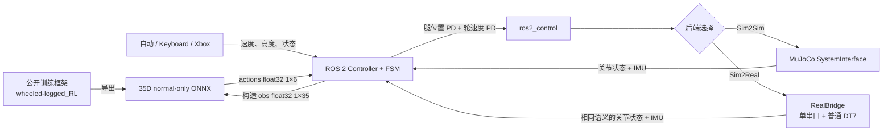

# WheelBipe ROS 2 Sim2Sim / Sim2Real

26 赛季轮腿步兵强化学习的 ROS 2 / `ros2_control` 策略部署框架。仓库提供一条可直接运行的 normal-only 链路：读取机器人状态，构造 35 维观测，通过 ONNX Runtime 在 CPU 上推理 6 维动作，并通过统一的 `ros2_control` 接口驱动 MuJoCo 或真机硬件。

## Sim2Sim / Sim2Real 一键切换架构

策略、35D 观测、6D 动作、FSM、ROS topic、Keyboard 和 Xbox 都与执行后端解耦。Sim2Sim 与 Sim2Real 只在 `ros2_control` hardware plugin 层切换：默认命令运行 MuJoCo，增加 `--real` 即切到单串口真机驱动，无需修改控制器、重新导出 ONNX 或维护两套上层控制代码。

## 支持范围

| 项目 | 当前支持 |
| --- | --- |
| 系统 | Ubuntu 22.04 x86_64 |
| ROS | ROS 2 Humble |
| 仿真 | MuJoCo 3.5.0，GUI / Headless |
| 推理 | ONNX Runtime 1.20.0 CPU |
| 策略合同 | 单输入 `obs`：`float32[1,35]`；单输出 `actions`：`float32[1,6]` |
| 控制输入 | 仿真自动进入 RL、Keyboard、Xbox evdev、真机普通 DT7 |
| 策略模式 | normal-only；索引 28–34 恒为 `[1,0,0,0,0,0,0]` |
| 后端切换 | `./scripts/demo.sh` 为 MuJoCo；`./scripts/demo.sh --real` 为单串口真机 |

## 快速开始

安装 ROS 2 Humble 后，在仓库根目录执行：

```bash
./scripts/bootstrap.sh
./scripts/build.sh
./scripts/demo.sh
```

Ubuntu 24.04 等没有原生 Humble 二进制包的宿主机，可以使用仓库提供的
RoboStack 环境（需要已有 conda）：

```bash
conda env create -f environment-humble.yml
conda activate wheelbipe_humble
./scripts/bootstrap.sh --skip-rosdep
./scripts/build.sh
./scripts/demo.sh
```

无界面运行 10 秒：

```bash
./scripts/demo.sh --headless --duration 10
```

真机一键启动（默认 `/dev/wheelbipe_h7`，普通 DT7 输入，且不会自动进入 RL）：

```bash
./scripts/check_real.sh
./scripts/demo.sh --real
```

临时串口路径可用 `--serial-port /dev/ttyUSB0` 覆盖。真机使用 Keyboard 时执行 `./scripts/demo.sh --real --no-dt7`；使用 Xbox 时执行 `./scripts/demo.sh --real --xbox`。首次运行前必须完成 udev/权限配置并阅读 [DEPLOY.md](DEPLOY.md) 的真机安全边界。

Xbox 控制：

```bash
./scripts/check_xbox.sh
./scripts/demo.sh --xbox
```

仿真窗口现在直接支持按住方向键移动，无需另开键盘终端：

- `W/S`：前进/后退（使用当前速度档，默认 0.8 m/s）；`A/D`：左转/右转（1.2 rad/s），可组合按键。
- 松开对应按键，其速度命令立即清零；相反方向同时按下互相抵消。切走窗口也清零。
- 每按一次 `↑/↓` 将速度档增加/减少 0.1 m/s，范围 0–2.5 m/s，窗口显示当前速度；长按不会连续变档。`T/G` 调整高度，默认 0.40 m。
- `Space` 暂停/继续，`Backspace` 回出生点，`F` 切换相机跟随。
- 鼠标左键拖动旋转视角、右键拖动平移、滚轮缩放。

速度清零指控制命令归零，机器人仍会经历制动和平衡过程。
使用外部键盘节点时需关闭窗口发布器，避免两个输入源相互覆盖：

```bash
./scripts/demo.sh --no-viewer-keyboard
```

第二个终端执行：

```bash
source setup_ros_domain.bash
ros2 run keyboard_teleop keyboard_teleop_node --ros-args \
  --params-file src/tools/keyboard_teleop/config/keyboard_teleop_params.yaml
```

`0/1/2/3` 切换 INIT/IDLE/PREPARE/RL，`w/s` 控制前进速度，`a/d` 控制偏航角速度，`t/g` 调整高度。

### RMUC2026 地图

新克隆仓库需要先按下文离线转换原始 STL 并安装地图资源；生成网格不随 Git 分发。

```bash
conda activate wheelbipe_humble
./scripts/demo_rmuc.sh
```

默认载入本机导出的 `UniLab-V14-35-rough-ros2-motion-stop200.onnx`，在仿真窗口内按住 WASD
操作。先等待机器人进入 RL，再移动。该配置使用 source_v14 机器人；200 mm 验收场景
仍可通过 `./scripts/demo_step200.sh` 启动。Xbox 模式会自动关闭窗口键盘发布。

地图默认模型已针对停止、倒退重新训练：原 gpu598 在零命令下仍约 1.1 m/s 前进，
不能用来判断键盘是否正常。新 motion-stop200 的实测零速残余约 0.03–0.04 m/s，
倒退命令 -0.8 m/s 时实际约 -0.56 m/s；它不是位置锁定控制器，仍有慢漂移。
新模型尚未通过 200 mm 竖直台阶验收，不能把旧模型的越障结果算到新模型上。
若终端曾导出旧的 `WHEELBIPE_RL_MODEL_PATH`，可使用
`env -u WHEELBIPE_RL_MODEL_PATH ./scripts/demo_rmuc.sh` 明确启用新的默认模型。

地图来自 `/home/gx/RMUC2026-0915.STL`，按毫米转米，平面大小约 29.15 × 16.05 m。
主要地面移到 z=0，出生点约 (-12.316, -2.748, 0.38)，面向 +X。
显示保留原 STL 全部 1,734,280 个三角面，只分块加载，不减面、不平滑或删除细节。
机器人仅显示精细网格，隐藏重叠的碰撞代理，避免影响观感。
碰撞采用从原始 STL 采样的约 20 mm 高度场。
这是上表面近似：竖直边缘有约一个网格的过渡，桥下、悬空结构下方和隧道不能准确通行，
不应用此场景代替精确竖直台阶验收。地图仅用于仿真，不表示策略已通过全地图越障测试。

地图转换发生在离线阶段；修改源 STL 后重新生成并安装资源：

```bash
uv run --no-project --with trimesh --with scipy python \
  src/resources/robot_descriptions/tools/import_rmuc_terrain.py /home/gx/RMUC2026-0915.STL
source setup_ros_base.bash
colcon build --packages-select robot_descriptions
```

转换参数、源文件 SHA256 和出生点净空保存在
`src/resources/robot_descriptions/wheelbipeV14_2/mjcf/terrain_rmuc2026/metadata.json`。

依赖安装、离线部署和故障处理见 [DEPLOY.md](DEPLOY.md)；35D 索引、动作语义和所有公开参数见 [PARAMETERS.md](PARAMETERS.md)。

## 数据流



## 项目结构

```text
.
├── README.md                  # 项目入口与快速开始
├── DEPLOY.md                  # 环境、构建、运行和故障处理
├── PARAMETERS.md              # 唯一接口与参数说明
├── LICENSE
├── THIRD_PARTY_NOTICES.md
├── scripts/                   # bootstrap、build、demo、环境/手柄检查
└── src/
    ├── controllers/           # 35D 策略控制器和 ONNX 模型
    ├── interfaces/            # MuJoCo 与单串口 RealBridge 后端
    ├── middlewares/           # 一键 bringup 与控制器编排
    ├── resources/             # URDF/Xacro、MJCF、网格和资产许可
    └── tools/                 # Keyboard / Xbox 输入
```

使用文档仅保留本页、`DEPLOY.md` 和 `PARAMETERS.md`。`LICENSE`、第三方声明和模型/网格资产许可作为法律许可文件保留。

## 许可

源码许可见 [LICENSE](LICENSE)。ONNX 模型、MuJoCo、ONNX Runtime 与机器人网格的来源和许可见 [THIRD_PARTY_NOTICES.md](THIRD_PARTY_NOTICES.md) 及对应资产目录中的许可文件。

## 引用 / Citation

如果本项目对你的研究有所帮助，请考虑引用：

If you find this project useful in your research, please consider citing:

```bibtex
@software{wheelbipe_ros2_sim2sim2026,
  author = {Zhang, Zhirui and Cui, Yu},
  title = {WheelBipe ROS 2 Sim2Sim / Sim2Real: Policy Deployment for Wheeled-legged Robots},
  url = {https://github.com/scutrobotlab/wheelbipe_ros2_sim2sim},
  year = {2026}
}
```

### UniLab 长训练最终模型

2026-09-17 完成追加 10,000 轮训练，最终检查点为 `model_10199.pt`。
随仓库提供 `UniLab-V14-35-rough-ros2-long10199.onnx`，可显式选择：

```bash
WHEELBIPE_RL_MODEL_PATH="$PWD/src/controllers/template_ros2_controller/policy/parallel/UniLab-V14-35-rough-ros2-long10199.onnx" \
./scripts/demo_rmuc.sh
```

导出为 35D 输入、6D 输出；128 组普通模式输入与 TorchScript 的最大绝对差为
6.68e-6。该最终模型尚未完成原生 ROS2 停车、倒退和 200 mm 越障联合验收，
因此不改变 `demo_rmuc.sh` 的默认模型。模型 SHA256：
`f42eeb637bf6faa8ac61866973c2f82c20624a7797097ee5871a18a0059c3957`。

### 200 mm 源策略越障复现

已移除场景中的三个低矮障碍。200 mm 垂直台阶的源策略验证使用
`./scripts/demo_step200.sh`，并以 0.40 m 高度命令、2.5 m/s 速度从 2.7 m 外直线接近。
模型、双终端启动命令、键鼠操作、原生 ROS2 验收记录与物理转换边界见
[200 mm 复现说明](artifacts/step200_restore_20260916/README.md)。
